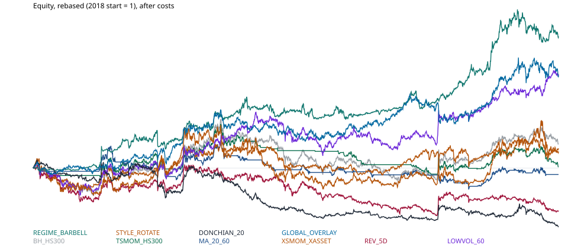

# 交易策略研究 2026-10-03

研究日：2026-10-03（周六，北京时间）。A 股最近一根 K 线是 **2026-09-30**。10 月 1 日、2 日没有 A 股行情返回，本次不补价。复市日期没有另拉交易所日历，下文只写「下一交易日开盘」。

可执行实现：`scripts/daily_strategy_research/run_20261003.py`  
本次数字快照：`scripts/daily_strategy_research/output/20261003/metrics.json`  
净值图：`reports/trading_strategy_research_20261003_equity.svg`



操作者附加焦点是 **curl 测试**。价格、行情快照和新闻都用 `curl` 拉取。不通的源记为缺口，不换一套假数据。

## 1. Executive Summary（结论摘要）

2018-01-01 至 2026-09-30，在 12 bps 单边成本、次日开盘成交、不加杠杆、不做空的设定下，测了 9 条彼此不同的 ETF 规则，基准是买入持有华泰柏瑞沪深 300ETF（510300）。

**没有一条主动规则达到技能里的完整质量条**（扣成本后稳定打败相关基准、全样本 Sharpe 优于 1、最大回撤小于 30%、而且不是单参数或单一资产牛市）。Sharpe 的标准误大约 0.3–0.6，下面的点估计不能当成统计上已经证实的 alpha。

相对结论：

- 只做沪深 300 的时序动量、20/60 均线，样本外没有edge。把空仓换成十年国债 ETF，结论不变。
- 5 日反转和 20 日唐奇安突破被换手打穿。年化换手大约 57 倍和 189 倍。
- 低波轮动（LOWVOL）扣成本后确实跑赢沪深 300，邻域参数方向一致，但全样本 Sharpe 0.55、最大回撤 -34.9%，而且和基准日收益相关 0.88。它是大盘/红利/银行倾斜，不是独立策略。
- 周频风险开关（REGIME）全样本 CAGR 10.9%、回撤 -15.1%，看起来最好。约 76% 的决策日其实是 50% 黄金 + 50% 十年国债。同一窗口里**被动**持有这个组合，Sharpe 1.16，高于主动开关的 0.91。多出来的收益主要是 2018 年以来的黄金牛市，不是切换技术。
- 全球叠加（GLOBAL）跑赢纯沪深 300，也略好于静态 70/30 沪深 300+黄金，但明显差于被动 50/50 纳指 ETF+黄金（CAGR 8.6% 对 18.5%）。择时没有吃到它自己使用的那两个强势资产。

因此本次不建议把任何规则放到实盘。若只做纸面跟踪，唯一还说得通的是低波大盘倾斜，而且必须当成权益内部的风格暴露，并接受它会在成长股反弹里落后。

## 2. Market Analysis（市场与数据）

### 2.1 curl 探针（2026-10-03 实跑）

| 源 | 结果 | 用途 |
| --- | --- | --- |
| 腾讯日 K `web.ifzq.gtimg.cn` qfq | 通 | 回测主数据。按两年分段拼接，重叠日期收盘价冲突数为 0 |
| 腾讯实时报价 `qt.gtimg.cn` | 通 | 最后一根 K 线对现价。全部交易标的偏差在 0.3% 以内，否则中止回测 |
| 新浪日 K | 通，但单次大约只给最近 1000 根 | 指数点位交叉核对，不进收益 |
| Yahoo chart | 通 | 宏观序列，以及复权质量对照。**不**作为 A 股收益主源 |
| 东方财富 K 线 | `curl: (52) Empty reply` | 缺口 |
| 东方财富报价 | HTTP 502 | 缺口 |
| NewsNow `cls-hot` / `wallstreetcn-quick` / `jin10` | 带浏览器 UA 后为 JSON | 只作标题背景，不进信号 |

沪深 300 现价交叉：腾讯报价 4357.62（20260930161412），新浪日 K 收盘 4357.616。510300 最后一根前复权收盘 4.432，与腾讯现价 4.432 一致。

Yahoo 复权不可靠，所以弃用：

- 510300：2018-01-02 至 2026-09-30，腾讯 qfq 累计 +27.4%，Yahoo `adjclose` +25.5%，日收益相关 0.998。这条对照是合格的。
- 510880 红利 ETF：腾讯 qfq 约 +67%，Yahoo adj 约 +58%，日收益相关 0.989。方向相同，幅度有大约 9 个百分点差距。
- 512800 银行 ETF：Yahoo 的 close 与 adjclose 相同，2018 以来价格收益约 -17%；腾讯 qfq 约 +66%（0.515 → 0.853）。东方财富补不了第二份复权。银行 ETF 的分红复权**没有第二源**。低波组合平均大约 16% 的决策权重在这只 ETF 上，这是低波结果最大的数据风险。

引擎自检：买入持有规则的期末收益，与「2018 年首个交易日开盘买入、末日收盘卖出、只扣一次 12 bps」的手算一致，都是 **+29.13%**。

### 2.2 行情状态（事实）

A 股最后交易日 2026-09-30：

| 指数 | 点位 | 当日 |
| --- | ---: | ---: |
| 上证指数 | 3842.19 | +0.31% |
| 深证成指 | 12887.62 | -0.11% |
| 创业板指 | 3135.28 | -0.23% |
| 沪深 300 | 4357.62 | +0.29% |
| 中证 500 | 7435.16 | -0.06% |
| 中证 1000 | 7298.82 | -0.36% |
| 科创 50 | 1530.01 | -2.51% |
| 上证 50 | 2823.28 | +0.47% |

ETF 总收益（腾讯 qfq，至 2026-09-30）。21/63/252 日是交易日窗口。

| ETF | 2026 YTD | 21 日 | 63 日 | 252 日 | 20 日波动 | 2024 以来回撤 |
| --- | ---: | ---: | ---: | ---: | ---: | ---: |
| 沪深 300 510300 | -4.3% | -5.4% | -8.6% | -1.6% | 12.7% | -17.1% |
| 上证 50 510050 | -5.4% | -3.4% | -2.2% | -2.6% | 10.9% | -12.4% |
| 中证 500 510500 | +1.3% | -6.2% | -14.1% | +6.5% | 19.2% | -19.7% |
| 创业板 159915 | -1.0% | -8.7% | -21.9% | +3.9% | 27.1% | -33.7% |
| 中证 1000 512100 | -2.2% | -5.7% | -14.9% | +0.5% | 22.5% | -27.1% |
| 红利 510880 | +10.8% | -3.5% | +12.5% | +12.3% | 15.4% | -15.4% |
| 银行 512800 | +3.7% | +2.9% | +14.0% | +4.5% | 13.6% | -19.0% |
| 证券 512880 | -15.0% | -6.9% | -10.5% | -18.5% | 18.8% | -28.2% |
| 消费 159928 | -17.0% | -1.2% | +4.8% | -25.6% | 18.2% | -35.4% |
| 医药 512010 | +2.6% | +3.2% | +8.7% | -12.4% | 22.1% | -29.8% |
| 黄金 518880 | -7.2% | -5.5% | +1.9% | +8.9% | 20.3% | -30.5% |
| 十年国债 511260 | +3.2% | +0.3% | +1.0% | +3.5% | 0.5% | -2.3% |
| 纳指 513100 | +23.5% | +5.8% | +9.0% | +36.2% | 15.0% | -24.0% |
| 标普 513500 | +10.5% | -0.9% | +8.3% | +20.6% | 14.7% | -24.9% |
| 半导体 512480 | +30.5% | -9.7% | -29.3% | +39.0% | 36.3% | -38.7% |
| 科创 50 588000 | +14.0% | -9.1% | -23.7% | +14.7% | 31.7% | -31.2% |
| 煤炭 515220 | +22.2% | -8.9% | +13.9% | +21.6% | 26.6% | -30.8% |
| 光伏 515790 | -19.3% | -7.0% | -20.7% | -13.3% | 21.6% | -34.8% |
| 酒 512690 | -22.2% | -0.5% | +5.3% | -32.6% | 21.1% | -47.3% |

半导体、科创 50、光伏、酒、煤炭上市晚，只进入截面描述，不进入 2018 年起的组合回测。

解读（与上表分开）：宽基不是牛市。沪深 300 过去一个季度约 -9%，2026 年以来总收益为负，20 日波动大约 13%，属于阴跌而不是流动性危机。结构上红利、银行、煤炭强，创业板、科创、半导体在过去一个季度里跌得更多，消费、证券、酒是年内落后的一组。黄金 ETF 在 2025 年大涨之后，2026 年以来 -7.2%，距 2024 以来高点大约 -30%，和部分「黄金大涨」标题不是同一时段。

离岸（Yahoo，不是 A 股填充）：

- 标普 500：2026-10-02 收于 7722.72。近 5 个交易日 -0.3%，近 63 个交易日 +2.5%。
- VIX：15.31。近 63 个交易日大约 -5%。波动率不高。
- 美国 10 年期收益率报价：5.28%。这是收益率水平，不是债券涨跌。相对约 21 个交易日前上升大约 0.48 个百分点，相对约 63 个交易日前上升大约 0.80 个百分点。
- 美元兑人民币：2026-10-03 报价 6.7048。近 63 个交易日大约 -1.3%（人民币略强）。

新闻标题（NewsNow 缓存，未核对成官方数据）：财联社热榜里有「9 月非农低于预期」「美联储加息概率下降」「美股光通信与存储走强」「原油黄金齐涨」「华为与赛力斯五年合作」「人形机器人」。华尔街见闻/金十同时有中东相关标题。这些只说明信息流里的话题，不作为交易证据。非农数字本身没有从官方源复核。

没有期权流，没有可用的一致预期/估值面板，所以本次没有基本面多空或事件驱动规则。这是缺口，不是「基本面无效」。

### 2.3 流动性

交易宇宙近 60 日成交额中位数大约 3 亿到 63 亿元人民币。最低的消费 ETF 约 3.1 亿元，仍高于规则里的 5000 万过滤。12 bps 滑点假设对应的是远小于成交额 1% 的订单。这次结果不能外推到需要冲击成本模型的规模。

## 3. Strategy Details（策略说明）

共同契约（写在回测里，不是口头假设）：

- 信号只用当日收盘及更早的数据。
- 下一交易日开盘成交。两次调仓之间持股数不变，权重随价格漂移，不为漂移再付手续费。
- 权重在 0 和 1 之间，合计不超过 1。现金收益按 0。不做空，不加杠杆。
- 主成本 12 bps 单边（佣金加滑点）。A 股 ETF 无印花税。压力测试用 25 bps 和 40 bps。
- 样本 2018-01-01 至 2026-09-30。样本内到 2022-12-31，样本外从 2023-01-01。指标需要的历史用 2016–2017，不把那段损益算进成绩。
- 参数在跑完主结果之前写死。邻域只用来看是不是单点，不把最好的邻域改成主规则。

交易宇宙：510300、510500、510050、159915、512100、510880、512800、512010、159928、512880、518880、511260、513100、513500。

| 规则 | 类型 | 做法 |
| --- | --- | --- |
| BH_HS300 | 基准 | 始终 100% 510300 |
| TSMOM_HS300 | 时序动量 | 510300 的 120 日收益 > 0 则满仓，否则现金。每日可切换 |
| MA_20_60 | 均线趋势 | 20 日均线高于 60 日均线则满仓 510300，否则现金 |
| XSMOM_XASSET | 截面动量 | 月末。过去 126 日收益、跳过最近 21 日。股票、黄金、国债、海外 ETF 里取前 3，等权 |
| REV_5D | 短周期反转 | 每 5 个交易日，股票 ETF 里买过去 5 日最差的 3 只 |
| LOWVOL_60 | 低波 | 月末。股票 ETF 里买 60 日波动最低的 3 只 |
| REGIME_BARBELL | 风险开关 | 每 5 个交易日。沪深 300 的 60 日收益为正且 20 日波动不高于其 252 日中位数，则买 60 日动量最强的 2 只股票 ETF；否则 50% 黄金 + 50% 十年国债 |
| STYLE_ROTATE | 风格 | 月末。创业板、红利、上证 50 里只买 60 日最强的 1 只 |
| DONCHIAN_20 | 通道突破 | 每日。收盘价突破**不含当日**的 20 日高点的股票 ETF，最多 4 只等权；没有则 100% 黄金 |
| GLOBAL_OVERLAY | 全球叠加 | 月末。沪深 300 的 120 日收益为负，则 50% 纳指 ETF + 50% 黄金；否则 70% 沪深 300 + 30% 黄金 |

经济理由，分别对应，也分别可能是错的：

- 时序动量 / 均线：A 股宽基有明显的年度级熊市，空仓能躲回撤。失败方式是来回止损，2024 年 9 月那种急转弯就是典型。
- 截面动量：强者恒强若来自资金拥挤，应该能在 ETF 之间转移。失败方式是风格一个月就反转。
- 反转：短期跌多了有流动性回补。失败方式是交易成本高于均值回归。
- 低波：高波动小盘长期给的风险补偿不稳定，红利和银行还有分红。失败方式是成长牛、以及分红复权被高估。
- 风险开关：跌势里持有黄金和国债，涨势里持有强势行业。失败方式是大部分时间其实只是持有黄金，切换本身不增加 Sharpe。
- 风格单押：成长和红利不同时领先。失败方式是押中一只高波动 ETF，回撤接近 50%。
- 突破：趋势启动时通道外追随。失败方式是 ETF 日频假突破，换手爆炸。
- 全球叠加：A 股走弱时，纳指和黄金提供另一条宏观路径。失败方式是规则在两条路径里来回，不如一直持有更强的那条。

核心执行代码（完整文件见上文路径）：

```python
# Signal at close t. Fill at the next open. Cash earns 0.
# cost_bps is charged on traded notional at the open.
def run_backtest(opens, closes, target, flags, cost_bps):
    ...
    if flags.loc[prev_date]:
        equity_open = cash + shares_marked_at_open
        rebalance shares to target.loc[prev_date]
        cash = equity_open - invested_open - traded_notional * cost_bps / 10000
    equity_close = cash + shares_marked_at_close
```

成交假设若改成「信号当日收盘就能成交」，会比现在乐观。主结果没有用那种假设。

## 4. Backtest Results（回测结果）

无风险利率按 0。Sharpe 因此偏宽，尤其不能拿来和十年国债 ETF 的 Sharpe 直接比「谁更聪明」：国债波动大约 0.5%–几个点，Sharpe 自然高。下表 Sharpe 旁边给了近似标准误 \(\sqrt{(1+0.5 S^2)/T}\)，T 为年数。

### 4.1 主结果，12 bps

| 规则 | 总收益 | CAGR | 波动 | Sharpe | 标准误 | Sortino | 最大回撤 | 月胜率 | 盈亏比 | 年化换手 | 平均仓位 |
| --- | ---: | ---: | ---: | ---: | ---: | ---: | ---: | ---: | ---: | ---: | ---: |
| BH_HS300 | 29.1% | 2.97% | 21.8% | 0.25 | 0.34 | 0.35 | -44.7% | 54% | 1.05 | 0.1x | 1.00 |
| TSMOM_HS300 | 2.8% | 0.32% | 16.2% | 0.10 | 0.34 | 0.10 | -37.6% | 31% | 1.03 | 9.4x | 0.53 |
| MA_20_60 | -7.1% | -0.84% | 15.2% | 0.02 | 0.34 | 0.02 | -41.9% | 32% | 1.00 | 5.5x | 0.49 |
| XSMOM_XASSET | 23.8% | 2.48% | 19.1% | 0.23 | 0.34 | 0.29 | -29.8% | 53% | 1.04 | 8.4x | 1.00 |
| REV_5D | -47.6% | -7.13% | 22.9% | -0.22 | 0.34 | -0.31 | -54.8% | 37% | 0.96 | 56.9x | 1.00 |
| LOWVOL_60 | 108.2% | 8.75% | 19.0% | 0.55 | 0.36 | 0.78 | -34.9% | 56% | 1.11 | 4.4x | 1.00 |
| REGIME_BARBELL | 147.9% | 10.94% | 12.8% | 0.91 | 0.40 | 1.17 | -15.1% | 63% | 1.20 | 18.2x | 1.00 |
| STYLE_ROTATE | 20.6% | 2.17% | 26.8% | 0.22 | 0.34 | 0.30 | -48.6% | 47% | 1.04 | 8.1x | 1.00 |
| DONCHIAN_20 | -65.4% | -11.42% | 19.8% | -0.54 | 0.36 | -0.75 | -68.6% | 32% | 0.90 | 189x | 1.00 |
| GLOBAL_OVERLAY | 105.7% | 8.60% | 15.3% | 0.64 | 0.37 | 0.84 | -21.5% | 62% | 1.12 | 4.2x | 1.00 |

样本内 / 样本外：

| 规则 | 样本内 CAGR | 样本内 Sharpe | 样本内回撤 | 样本外 CAGR | 样本外 Sharpe | 样本外回撤 |
| --- | ---: | ---: | ---: | ---: | ---: | ---: |
| BH_HS300 | 0.93% | 0.16 | -40.2% | 5.76% | 0.41 | -24.2% |
| TSMOM_HS300 | 3.79% | 0.31 | -20.5% | -4.14% | -0.22 | -21.9% |
| MA_20_60 | -1.45% | -0.01 | -30.4% | -0.03% | 0.06 | -25.1% |
| XSMOM_XASSET | -0.28% | 0.08 | -28.1% | 6.28% | 0.44 | -19.2% |
| REV_5D | -7.58% | -0.22 | -39.6% | -6.54% | -0.22 | -34.5% |
| LOWVOL_60 | 4.77% | 0.33 | -34.9% | 14.32% | 1.01 | -17.5% |
| REGIME_BARBELL | 10.10% | 0.80 | -15.1% | 12.11% | 1.06 | -13.4% |
| STYLE_ROTATE | -3.98% | -0.02 | -48.6% | 11.00% | 0.55 | -30.9% |
| DONCHIAN_20 | -14.15% | -0.77 | -60.1% | -7.67% | -0.28 | -43.1% |
| GLOBAL_OVERLAY | 6.47% | 0.50 | -21.5% | 11.53% | 0.83 | -18.4% |

分年收益（%）：

| 年 | 沪深300 | 时序动量 | 均线 | 截面动量 | 反转 | 低波 | 风险开关 | 风格 | 突破 | 全球叠加 |
| --- | ---: | ---: | ---: | ---: | ---: | ---: | ---: | ---: | ---: | ---: |
| 2018 | -28.7 | -7.1 | -3.6 | -19.8 | -37.2 | -25.1 | 3.4 | -27.2 | -11.1 | -2.9 |
| 2019 | 47.3 | 23.3 | 6.6 | 22.3 | 35.1 | 43.7 | 29.1 | 26.0 | 6.2 | 22.3 |
| 2020 | 33.0 | 17.7 | 13.5 | 26.5 | 13.5 | 17.2 | 14.0 | 43.4 | -3.8 | 30.6 |
| 2021 | -4.3 | -8.5 | -14.3 | -0.7 | -6.8 | 24.5 | 6.9 | -23.9 | -38.2 | -3.2 |
| 2022 | -21.7 | -2.4 | -7.0 | -20.0 | -24.8 | -19.6 | -0.7 | -18.4 | -16.9 | -8.9 |
| 2023 | -10.4 | -12.5 | -0.6 | 4.0 | -17.1 | -1.4 | 3.3 | -0.3 | -4.1 | 18.2 |
| 2024 | 18.4 | -2.1 | -5.7 | 14.8 | 22.6 | 31.7 | 11.7 | 12.6 | 18.0 | -3.5 |
| 2025 | 21.5 | 16.5 | 11.8 | 1.2 | -2.3 | 13.8 | 44.0 | 41.8 | -11.5 | 31.3 |
| 2026 YTD | -4.3 | -14.5 | -4.8 | 3.9 | -21.8 | 11.7 | -7.7 | -7.2 | -25.9 | 0.5 |

2026 只到 9 月 30 日。低波今年的领先，和红利/银行相对沪深 300 的走势是同一件事。风险开关 2025 年 +44%，而黄金 ETF 当年大约 +57%，不能把这一年读成择时技能。

### 4.2 成本和延迟

40 bps 单边之后，全样本 CAGR：低波 7.43%（Sharpe 0.49），风险开关 5.43%（Sharpe 0.49），全球叠加 7.33%（Sharpe 0.56），基准仍约 2.93%。样本外风险开关只剩 6.42%，基准 5.76%，优势几乎消失。反转和突破在 25 bps 时已经更差。

信号再晚一个交易日（决策和目标权重一起后移）：低波全样本 Sharpe 0.53，风险开关 0.79，全球叠加 0.67。这三条没有因为多等一天就消失。时序动量样本外仍然为负。

时序动量和均线若在空仓时改持十年国债 ETF，而不是现金：CAGR 只到 1.14% 和 0.73%，样本外 Sharpe 仍然大约 -0.22 和 0.15。空仓收益设成 0 并没有错杀这两条规则。

### 4.3 参数邻域

同一家族、12 bps、事先列出的邻近参数：

- 时序动量 60/120/200 日：全样本 Sharpe 0.01 / 0.10 / 0.05。没有一组样本外稳定为正。
- 均线 10/40、20/60、50/200：全样本 Sharpe 最高是 50/200 的 0.29，样本外 CAGR 2.80%，仍低于基准 5.76%。
- 截面动量：主规则 126/21/前 3 名全样本不赢基准。252 日跳过 21 日的样本外 CAGR 16.3%、Sharpe 0.98，但全样本 Sharpe 只有 0.36。这是看到结果之后才显眼的参数，**不升级成主规则**。
- 反转 3/5/10 日：三组都是负的。
- 低波 20/60/120 日：全样本 Sharpe 0.47 / 0.55 / 0.42，样本外 CAGR 11.4% / 14.3% / 8.0%，都高于基准 5.76%。方向稳，幅度一般。
- 唐奇安 10/20/55 日：10 日和 20 日为负。55 日样本外 Sharpe 0.04，CAGR 仍为负。
- 风险开关：60 日、波动窗口 10 或 20、持有 2 或 3 只时，全样本 Sharpe 大约 0.80–0.91。把动量改成 40 日，全样本 Sharpe 降到 0.54。改成月末再平衡，全样本 Sharpe 降到 0.55，样本外反而到 1.26。成绩依赖周频。只持有 1 只时全样本 Sharpe 1.06，但更集中，违反分散要求，不采用。
- 全球叠加：120 日主规则 Sharpe 0.64。改成风险开启时不留黄金，样本外 CAGR 4.41%，低于纯沪深 300。防御端改成只持黄金、不持纳指，样本外 CAGR 7.13%，优势变薄。黄金仓位是结果的承重墙。

### 4.4 被动对照（不是候选策略）

这些组合用同一套成交和 12 bps 成本，用来回答「主动规则是不是只是持有了强势资产」。

| 对照 | CAGR | Sharpe | 最大回撤 | 和主动规则的关系 |
| --- | ---: | ---: | ---: | --- |
| 100% 黄金 ETF | 14.10% | 0.93 | -30.5% | 2018 以来收盘价大约 +217% |
| 100% 十年国债 ETF | 4.36% | 1.67 | -4.8% | 低波动资产本身，不是择时 |
| 50/50 黄金+十年国债 | 9.39% | 1.16 | -15.5% | 风险开关在 76% 的决策日持有的就是这个 |
| 70/30 沪深300+黄金 | 6.82% | 0.50 | -29.5% | 全球叠加在风险开启时的静态版 |
| 50/50 纳指 ETF+黄金 | 18.45% | 1.26 | -18.0% | 全球叠加在风险关闭时的静态版 |
| 100% 纳指 ETF | 20.99% | 0.95 | -28.5% | 路径极强，不能当成 A 股 alpha |

风险开关相对「一直持有黄金+国债」：CAGR 10.94% 对 9.39%，Sharpe 0.91 对 1.16，回撤都在 -15% 左右。多出来的 CAGR 伴着更高波动和 18 倍换手，风险调整后没有赢。

全球叠加相对「一直持有纳指+黄金」：CAGR 8.60% 对 18.45%。择时把钱送回了更弱的 A 股。相对静态 70/30 沪深 300+黄金（CAGR 6.82%）它是好的，所以它只证明「少拿一点纯 A 股 beta」有用，不证明切换规则有用。

低波与黄金日收益相关大约 0.06，与沪深 300 相关 0.88。它不是伪装的黄金仓。

相关关系也说明风险开关和基准只有 0.35 的日相关，原因是它大多数时间不在股票里。

### 4.5 2026-09-30 收盘时的目标仓位

这些权重要到下一交易日开盘才按规则成交。不是下单指令。

| 规则 | 目标 |
| --- | --- |
| 低波 | 上证 50、红利、银行 ETF 各 1/3 |
| 风险开关 | 黄金 50%，十年国债 50%（60 日动量为负，风险关闭） |
| 全球叠加 | 纳指 ETF 50%，黄金 50%（120 日动量为负） |
| 时序动量 / 均线 | 现金 |
| 截面动量 | 证券、纳指、标普 ETF 各 1/3 |
| 反转 | 中证 500、创业板、中证 1000 各 1/3 |
| 风格 | 100% 红利 ETF |
| 突破 | 100% 医药 ETF |

低波的历史决策权重均值大约是：上证 50 25%、沪深 300 20%、中证 500 17%、银行 16%、红利 12%。不是秘密地押住一只票，但也明确偏向大盘和金融红利。

## 5. Comparison & Ranking（比较与排序）

排序只在「扣成本、看样本外、看邻域、再和被动对照比」之后进行。基准是沪深 300 ETF。黄金和纳指的大牛市单列，避免把资产 beta 写成规则 edge。

| 排名 | 规则 | 是否打败沪深300 | 全样本 Sharpe / 回撤 | 邻域 | 对照之后的判断 |
| --- | --- | --- | --- | --- | --- |
| 1 | LOWVOL_60 | 全样本和样本外都是 | 0.55 / -34.9% | 20/60/120 日都赢基准 | 最好的权益内部结果。未达到 Sharpe>1 和回撤<30%。高相关，是风格 |
| 2 | GLOBAL_OVERLAY | 是 | 0.64 / -21.5% | 去掉黄金或纳指就明显变弱 | 输给被动纳指+黄金。不作为择时 edge |
| 3 | REGIME_BARBELL | 是 | 0.91 / -15.1% | 周频和 60 日动量附近才好看；月末全样本 Sharpe 0.55 | 输给被动黄金+国债的 Sharpe。不作为择时 edge |
| 4 | XSMOM_XASSET | 全样本否（2.48% < 2.97%） | 0.23 / -29.8% | 有一个更长回看的样本外好看 | 不达标。不把 252 日版本追认为赢家 |
| — | STYLE_ROTATE | 全样本否 | 0.22 / -48.6% | 单资产 | 淘汰 |
| — | TSMOM / MA | 否，样本外更差 | ≤0.10 / 约 -40% | 整个邻域都弱 | 淘汰 |
| — | REV_5D / DONCHIAN_20 | 否 | 负 Sharpe | 邻域同向失败 | 淘汰。换手不可执行 |

低波没有「合格」印章。它只是九条里唯一同时满足：打败股票基准、换手可接受（约 4.4 倍/年）、多一档参数仍同向、而且不是黄金仓。回撤和 Sharpe 仍在质量条外面。

## 6. Final Recommendations（最终建议）

1. **不要实盘。** 本次没有任何规则在扣成本之后，同时具有全样本 Sharpe>1、回撤<30%，并且打败它真正暴露的那个被动组合。
2. **若要纸面跟踪一条权益规则，只跟踪低波。** 月末调仓，3 只等权，单边成本预算 12–25 bps。下一笔信号是 510050 / 510880 / 512800 各三分之一，成交假设为假期后的第一个开盘。仓位放在权益预算内部，不替代债券或黄金配置。2026 年以来它的领先和红利/银行行情是同一件事，反转后会落后。
3. **不要用这次的周频风险开关。** 它 76% 的时间就是黄金加国债。同一回测里一直持有这个组合，Sharpe 更高、换手接近 0。若投资约束允许持有黄金 ETF 和国债 ETF，被动比例比这次的切换规则更符合证据。这不是预测黄金会重复 2018–2025 的涨幅。黄金 ETF 2026 年以来已经 -7%，距阶段高点约 -30%。
4. **放弃 5 日反转和日频通道突破。** 在这组 ETF 上，扣成本后是稳定的负结果，不是差一点点参数。
5. **不要用 20/60 均线或 120 日时序动量择时沪深 300。** 样本外 CAGR 为 -0.0% 和 -4.1%。换成持有国债度过空仓期也补不回来。

截面动量和风格轮动不进入建议。前者全样本没有赢基准；后者回撤 -49%，而且只持有一只 ETF。

## 7. Deployment Considerations（部署注意）

即便只做纸面跟踪：

- 规模：消费 ETF 近 60 日成交额中位数约 3 亿元，黄金、沪深 300、创业板在 40–60 亿元量级。订单应远小于成交额的 1%。这次没有做冲击成本曲线。
- 单笔风险：低波是满仓三条权益 ETF，不是市场中性。2018 年它仍然 -25%，2022 年 -20%。权益 sleeve 的回撤预算至少要能承受 35%。
- 停止条件：滚动 12 个月相对沪深 300 的超额低于 -15%，或者最大回撤触及 -35%，暂停并重新研究，而不是现场改参数。
- 成本监控：实际单边成本若高于 25 bps，低波的优势还在但已经变薄；高于 40 bps 时只剩下大约 4 个百分点的 CAGR 差距，不值得运营。
- 数据监控：512800 的前复权没有第二源。若另一家复权源显示银行 ETF 总收益接近价格收益，低波结论作废。
- 日历：信号产生在 2026-09-30 收盘。在下一官方开盘之前不要用 10 月 1–3 日的外盘去改 A 股仓位，除非规则本身含有外盘，而且该外盘在规则里是预先写明的。
- 现金：规则里的现金收益是 0。实盘货币基金会略好于 0，但第 4.2 节已经表明这点补不上均线和时序动量。

## 8. What Could Go Wrong（失效条件）

- **黄金与美股路径结束。** 被动黄金、纳指的高 CAGR 是这段窗口的事实。2026 年以来黄金 ETF 已经转负。若未来三年黄金和纳指 ETF 回到 2022 年那种回撤，任何「多配它们就对了」的说法都不成立。风险开关和全球叠加会一起失效。
- **成长股反转。** 低波在 2020 年只有 +17%，基准是 +33%。创业板、科创、半导体若从 2026 年三季度的急跌里 V 型回去，低波会落后。这是风格，不是对冲。
- **银行 ETF 复权错误。** 腾讯 qfq 给银行 ETF 2018 以来大约 +66%，Yahoo 完全没有复权。东方财富本次不可用。若真实总收益靠近未复权价格，低波的一部分历史优势是数据。
- **周频规则的成本。** 风险开关年化换手 18 倍。40 bps 下样本外相对基准只剩不到 1 个百分点 CAGR。实盘滑点一旦接近压力情景，这条规则没有剩余。
- **2024 年 9 月式急转弯会重复。** 时序动量和均线在 2024 全年为负，而基准 +18%。全球叠加当年 -3.5%，静态 70/30 沪深 300+黄金当年大约 +22%。趋势规则在政策底上会晚。
- **多重比较。** 主规则 9 条，邻域又有三十多个变体。风险开关「只买 1 只」和截面动量「252 日」看起来更好，正是因为被看过。它们没有被提升为主规则。
- **Sharpe 噪声。** 低波 0.55±0.36，风险开关 0.91±0.40。区间都覆盖「其实很普通」。
- **缺的数据。** 无期权持仓，无盈利预期，无融资融券余额序列，无交易所官方假期表。宏观标题未与统计局/美联储原文核对。美国 10 年期使用的是收益率报价变动，不是国债期货盈亏。

自检：

- 还缺第二份银行 ETF 复权，以及官方假期日历。假设里最弱的是「12 bps 对所有 ETF 都够」，对证券、消费这类波动日可能偏紧，所以 40 bps 压力必须和主结果一起看。
- edge 与过拟合：主动规则相对沪深 300 的大部分正差距，落到黄金、纳指或红利/银行风格上。对照实验之后，不把它们叫作已验证 edge。
- 制度覆盖：2018 熊市、2020 疫情反弹、2021–2022 下跌、2024 政策脉冲、2025 黄金/部分权益上涨、2026 年防御风格。趋势规则没有同时通过这些阶段。
- 会改变判断的证据：一份独立复权源显示低波在 2018 以来不再跑赢沪深 300；或者未来 24 个月低波滚动超额持续为负。在那之前，它也只是纸面跟踪候选，不是可部署策略。
