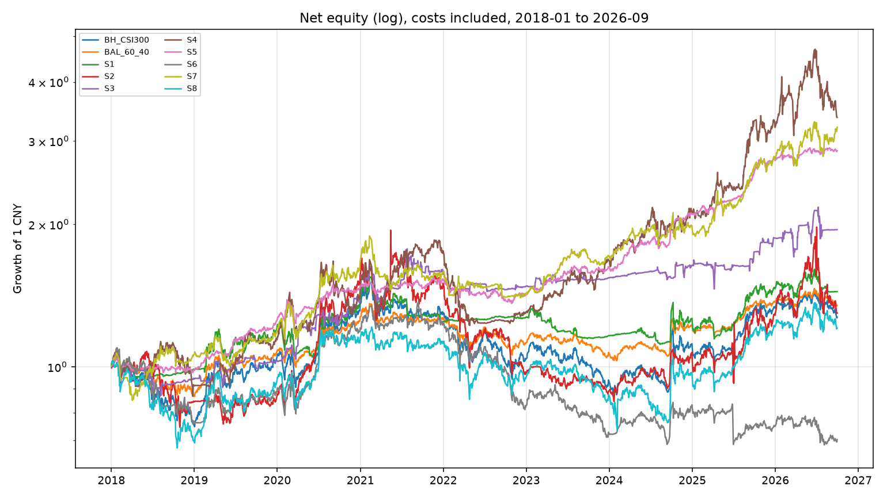

# 交易策略研究报告（2026-10-05）

研究日：2026-10-05（北京时间）。A 股样本截止 **2026-09-30**，当日是本次数据里最后一根 A 股 K 线。恒生指数、美元人民币、黄金期货已有 2026-10-05 行情，标普与美债收益率截止 2026-10-02。10 月 1 日为国庆节，A 股处于休市窗口；缺失交易日没有外推、没有填数。

结论先行：**8 条事前写定的规则里，没有一条达到可部署的证据门槛。** 全样本夏普超过 1、最大回撤小于 30%、并且在扣费后跑赢自身基准的，只有「逆波动风险平价」。它相对同资产等权的超额大约每年 1.7 个百分点，t 统计量 1.14，样本内超额接近 0。这是一条风险预算观察，不是已经证实的交易优势。

可复现实现：`scripts/trading_strategy_research/run_research.py`  
指标明细：`scripts/trading_strategy_research/output/metrics_20261005.json`



## 1. Executive Summary

| 排序 | 策略 | 全样本 CAGR / Sharpe / 最大回撤 | 相对自身基准 | 判定 |
| --- | --- | --- | --- | --- |
| 1 | S5 逆波动风险平价 | 12.8% / 1.24 / -11.8% | 全样本超额 +1.7pp，t=1.14；样本内超额 +0.2pp | 组合质量最好，增量 edge 未证实 |
| 2 | S7 唐奇安突破 | 14.3% / 0.79 / -26.0% | 样本外超额 +7.2pp，t=0.94；短参数超额为负 | 参数敏感，不部署 |
| 3 | S4 双动量 | 14.9% / 0.64 / -34.0% | 样本内超额 -1.0pp；126 日参数样本外超额 -10.5pp | 单一窗口与单一参数，不部署 |
| 4 | S3 趋势内五日反转 | 7.9% / 0.47 / -19.0% | 换手 21 倍/年；成本加倍后优势消失 | 不部署 |
| 5 | S1 沪深300 趋势/国债切换 | 4.3% / 0.26 / -28.1% | 样本外跑输买入持有 2.2pp | 不部署 |
| — | S2 截面动量、S6 低波动、S8 300/500 相对价值 | 夏普 ≤ 0.21，低波动全样本亏损 | 未跑赢对应基准 | 拒绝 |

质量门槛（同时满足才称为可部署证据）：扣费后跑赢**该策略自己的可交易基准**；全样本与样本外夏普都高于 1；全样本与样本外最大回撤都浅于 30%；样本内、样本外超额年化都超过 1 个百分点；样本外超额 t 统计量大于 2；盈利不集中在单一资产（绝对值份额不超过 65%）；成本加倍后仍跑赢基准；相邻参数不把结论打翻。按此标准，**合格数量 = 0**。

无风险利率假设为年化 1.5%（现金代理，不是当日 Shibor 或国债到期收益率的实测序列）。夏普、索提诺都是超额该利率之后的数字。谁跑赢基准只看两条净值的 CAGR 差，不使用这个利率；因此 1.5% 的取值不决定超额结论。它会平移夏普的绝对水平。

## 2. Market Analysis

### 2.1 数据与截止日

主数据是 Yahoo Finance 复权日线（`auto_adjust=True`），交易日历以华泰柏瑞沪深300ETF（510300）的实际会话为准，共使用 2016 年以后、截至 2026-09-30 的会话做预热，绩效从 **2018-01-02** 起算，到 **2026-09-30**，共 **2120** 个交易日。

交叉核对：

- 新浪日线：510300 在 2026-09-30 收盘 **4.432**。
- 腾讯前复权日线：同日收盘 **4.432**。与 Yahoo 收盘的相对差为 3.6e-8。
- 东方财富 K 线接口本次连接被远端关闭，没有拿到第二条独立源。缺口保留，不用它填数。
- 仓库里此前一份 2026-09-30 快照中的上证综指 3842.19、沪深300 指数 4357.62，与本次 Yahoo 指数收盘一致。

执行价用收盘，不用开盘。Yahoo 与腾讯都记录了若干“开盘远离当日其余价格”的打印，例如 511010 在 2019-08-06 开在 122.89、收在 114.38。这类开盘不能当作可成交价格。收盘与新浪/腾讯一致，因此收益定义为收盘到收盘。信号在 t 日收盘形成，t+1 日收盘成交，第一次完整赚到的是 t+2 日收盘相对 t+1 日收盘的涨跌。买入持有在评估窗口内与收盘收益逐日对齐（入场成本发生在 2018 年之前的预热段，不在绩效窗里重复扣）。这个对齐有引擎断言。

没有使用的数据，因此也不在结论里出现：个股一致预期、财报点位、期权持仓与偏度、融资融券明细、北向资金的日频持仓。这些不是本次工具稳定可得的序列。

### 2.2 截至最后一根 A 股 K 线的状态

宽基处于均线下方的震荡偏弱，不是单边牛市。成长高波动且已经跌深。红利和银行相对抗跌。纳指 ETF 是唯一仍明显处于上升趋势的风险资产，但成交额薄，而且它是 QDII，价格里含有溢价，不等于纳斯达克指数。黄金的一年趋势已经破坏。

| 资产 | 2026 YTD | 近 20 日 | 近 60 日 | 近 252 日 | 相对 200 日均线 | 60 日波动 | 距 252 日高点 | 近 60 日日均成交额 |
| --- | ---: | ---: | ---: | ---: | ---: | ---: | ---: | ---: |
| 纳指ETF 513100 | +23.5% | +5.3% | +8.4% | +37.2% | +16.0% | 20% | -0.6% | 3.7 亿 |
| 科创50 588000 | +14.0% | -7.1% | -24.0% | +14.9% | -3.4% | 55% | -31.1% | 81.5 亿 |
| 红利 510880 | +10.7% | -3.3% | +10.6% | +11.6% | +4.7% | 17% | -3.7% | 6.7 亿 |
| 银行 512800 | +3.7% | +0.8% | +12.4% | +3.5% | +6.9% | 17% | -0.4% | 10.0 亿 |
| 医药 512010 | +2.7% | +2.7% | +9.6% | -12.0% | +4.5% | 27% | -13.4% | 5.0 亿 |
| 国债ETF 511010 | +1.9% | +0.1% | +0.4% | +2.6% | +0.9% | 0.4% | -0.0% | 24.1 亿 |
| 中证500 510500 | +1.0% | -5.2% | -12.1% | +5.8% | -6.7% | 31% | -17.3% | 37.0 亿 |
| 创业板 159915 | -1.0% | -7.6% | -19.8% | +5.3% | -10.6% | 43% | -28.2% | 72.2 亿 |
| 沪深300 510300 | -4.3% | -5.4% | -8.2% | -1.6% | -6.1% | 19% | -12.9% | 46.9 亿 |
| 上证50 510050 | -5.4% | -3.8% | -2.5% | -2.8% | -3.4% | 16% | -9.2% | 18.9 亿 |
| 黄金 518880 | -7.2% | -5.3% | +0.4% | +8.5% | -9.0% | 20% | -27.5% | 42.7 亿 |
| 证券 512880 | -15.0% | -7.6% | -8.4% | -18.7% | -7.6% | 19% | -20.4% | 19.6 亿 |
| 消费 159928 | -17.0% | -2.4% | +4.4% | -25.2% | -8.3% | 21% | -25.6% | 3.3 亿 |
| 军工 512660 | -19.8% | -3.5% | -11.5% | -8.3% | -15.5% | 31% | -34.5% | 3.1 亿 |
| 酒 512690 | -22.2% | -2.8% | +6.9% | -32.9% | -11.8% | 27% | -32.6% | 5.9 亿 |
| 半导体 512480 | -34.8% | -7.3% | -28.5% | -30.1% | -37.9% | 62% | -65.6% | 16.4 亿 |

2026 YTD 从 2025 年最后一个交易日收盘算到 2026-09-30。科创50 只进入行情表，不进入策略宇宙：它 2020 年 9 月才上市，放进 2018 年起的固定比较会改变样本构成。

宏观背景（行情水平，不是策略输入）：

- 上证综指 3842，2026 年以来 -3.2%，近 60 日 -3.7%。
- 恒生指数 23985（2026-10-05），2026 年以来 -6.4%。
- 标普 500 7723（2026-10-02），2026 年以来 +12.8%。
- 美元兑人民币 6.70（2026-10-05），2026 年以来 -4.3%，人民币偏强。
- 美国十年期国债收益率 5.28%（2026-10-02）。该收益率序列年初至今上升约 27%，对应年初水平大约 4.2%。这是收益率上行，不是国债价格上涨。
- COMEX 黄金期货约 4178 美元（2026-10-05），2026 年以来 -3.7%。境内黄金 ETF 同期 -7.2%，方向一致，幅度更大。

沪深300 买入持有（扣一次预热期之前的建仓成本之后，窗口内不再扣费）全样本 CAGR **2.8%**，夏普 **0.17**，最大回撤 **-42.2%**，波动 19.6%。2022 年 -20.1%，2023 年 -9.8%，2024 年 +17.4%，2025 年 +20.8%，2026 年至 9 月 30 日 -4.3%。这是后面所有“跑赢宽基”比较的锚。

### 2.3 机会在哪里，不在哪里

当前能从价格里直接读到的结构：

- 宽基趋势滤镜处于空头一侧（300、50 都在 200 日均线下方）。历史回测里，这条规则的样本外收益低于买入持有，所以“现在该空仓等均线”本身没有被证明是优势。
- 半导体、创业板、证券、酒、军工处于高波动下跌或均线下方。截面动量在 2022 年回撤 35%，低波动规则全样本亏损。两者都不支持把眼下的跌深当成可交易的反转信号。
- 红利、银行近 60 日相对强。低波动策略历史上会买这类资产，而该策略 2018–2026 年 CAGR 为 -4.0%。近期相对强势与这条历史规则的盈利能力是两件事。
- 纳指 ETF 趋势完整，流动性是硬约束：近 60 日成交额约 3.7 亿。按单日成交不超过 5% 估算，100% 仓位的账面容量大约在 1800 万人民币量级。
- 黄金仍有一年正收益，但价格已低于 200 日均线 9%，距一年高点 -27%。依赖黄金突破的规则，当前信号环境与 2024–2025 年的获利环境不同。
- 国债 ETF 全样本 CAGR 3.3%，夏普 0.95，最大回撤 -4.9%，波动约 2%。它是防御底仓的实测基线，不是股票 alpha。

## 3. Strategy Details

八条规则在看到结果之前写定。网格只做稳定性检查。主结果不是网格里样本外最好的那一档。样本内夏普最高的参数会单独标出，不替换主参数。

宇宙是仍在交易的场内 ETF。已退市产品没有进入，这是幸存者偏差，场内宽基 ETF 的退市较少，偏差存在但小于个股宇宙。银行、半导体、酒在各自凑满回溯窗口之后才有资格入选，上市前没有回填。

### 成本、成交与容量

A 股 ETF 不计印花税。单边成本 = 佣金 + 滑点：

- 流动性较好的权益 ETF 与黄金：2.5 bp 佣金 + 5 bp 滑点 = **7.5 bp / 边**
- 成交偏薄的证券（军工、消费、酒、纳指 ETF）：2.5 + 10 = **12.5 bp / 边**
- 国债 ETF：2.5 + 2 = **4.5 bp / 边**

换手按权重变化的绝对值计费。从股票换成债券，两边都付。不允许杠杆，权重和为 1。评估假设研究账户约 1000 万人民币：对沪深300、500、创业板、黄金、国债，这个规模相对近 60 日成交额可以忽略；对纳指 ETF、军工、消费，100% 或接近 100% 的仓位会碰到 5% 成交占比上限。下文容量按此口径说。

无风险利率 1.5% 是假设。合格与否同时看超额、回撤和参数稳定性；超额本身不依赖这个常数。

### 切分

- 预热：2016-01-01 起的可用行情，用于 200 日均线与 252 日动量。
- 样本内：2018-01-02 至 2022-12-30（1213 个交易日）。含 2018 下跌、2019–2020 上涨、2021 分化、2022 下跌。
- 样本外：2023-01-03 至 2026-09-30（907 个交易日）。2026 年不完整，只到 9 月 30 日。
- 另做一次压力：把 2024-09-24 至 2024-10-18 的策略收益和基准收益都置 0（14 个交易日），看样本外超额是否只来自政策跳空。

### 规则

基准与策略使用同一套成交滞后和费率。

| ID | 经济理由 | 规则（主参数） | 自身基准 |
| --- | --- | --- | --- |
| S1 | 慢趋势下，跌破长均线后继续暴露宽基的赔率变差，国债提供正Carry且回撤浅 | 510300 收盘高于 200 日均线则满仓，否则满仓 511010。每日更新 | 510300 买入持有 |
| S2 | 行为性反应不足会在行业之间留下 12-1 个月动量；A 股行业拥挤，所以要求动量为正，否则该名额进国债 | 每月末，在有 252 日历史的权益 ETF 中按「跳过最近 21 日的 252 日收益」排序，持有收益为正的前 3 名，等权；不足 3 名的权重进国债 | 同一权益宇宙的月度等权 |
| S3 | 上升趋势里的短期超卖往往是流动性冲击而不是基本面断裂 | 每 5 个交易日，在仍高于 200 日均线、且 5 日收益 ≤ -3% 的 ETF 中买入最差的最多 2 只；没有则满仓国债 | 510300 买入持有 |
| S4 | 同时做绝对动量和相对动量，避免在全部风险资产走弱时仍满仓相对最强者 | 每月末在 300、500、创业板、黄金、纳指 ETF 中选 252 日收益最高者；该收益同时高于 0 且高于国债的 252 日收益才持有，否则国债 | 上述资产加国债的月度等权 |
| S5 | 收益来自低相关资产的风险预算，而不是预测谁上涨。目标波动把组合从牛市杠杆里拉回来 | 每月末对 300、黄金、纳指 ETF 做 60 日逆波动，单资产上限 60%，再用协方差把组合波动缩放到 8%，剩余仓位给国债。不放大到 1 以上 | 这四只资产的月度等权 |
| S6 | 低波动异象：同样处于上升趋势时，实现波动更低的篮子有更高的风险调整收益 | 每月末，在高于 120 日均线的权益 ETF 中取 60 日波动最低的 3 只，等权；没有合格资产则国债 | 权益宇宙月度等权 |
| S7 | 通道突破捕捉持续的价格发现，和均线滤镜的进场点不同 | 300、500、创业板、黄金、纳指 ETF：收盘突破前 120 日高点则持有，跌破前 60 日低点则退出。同时持有的等权，一个都没有则国债 | 这五只资产的月度等权 |
| S8 | 大小盘相对定价会偏离后再收敛。A 股融券不稳定，所以只做多便宜的一边 | 60 日价格比 z 值。z>1.5 满仓 500，z<-1.5 满仓 300，\|z\| 回到 0.5 以内回到 50/50。有滞回，减少来回打 | 300 与 500 的月度等权 |

主参数：S1 均线 200；S2 回溯 252、跳过 21、前 3；S3 持有 5 日、阈值 -3%、均线 200；S4 回溯 252；S5 目标波动 8%、窗口 60；S6 均线 120、波动 60、前 3；S7 进场 120、出场 60；S8 窗口 60、进场 z=1.5、出场 z=0.5。

可执行代码在 `scripts/trading_strategy_research/run_research.py` 的 `strategy_*` 与 `run_backtest`。成交滞后的核心是：

```python
# 收盘信号 t 在 t+1 收盘成交，赚到的是截止 t+2 的收盘到收盘收益。
executed = weights.shift(2)
gross = (executed * close_to_close).sum(axis=1)
net = gross - sum(abs(delta_weight) * per_side_cost)
```

## 4. Backtest Results

费率已扣。夏普、索提诺相对 1.5% 现金假设。超额是相对上表「自身基准」的 CAGR 差。t 是日超额收益的均值除以标准误，不是多重检验校正后的 p 值。

### 4.1 基准

| 基准 | 全样本 CAGR | Sharpe | Sortino | 最大回撤 | 波动 | 样本内 Sharpe | 样本外 CAGR | 样本外 Sharpe | 样本外最大回撤 |
| --- | ---: | ---: | ---: | ---: | ---: | ---: | ---: | ---: | ---: |
| 沪深300 买入持有 | 2.8% | 0.17 | 0.24 | -42.2% | 19.6% | 0.07 | 5.6% | 0.32 | -22.6% |
| 国债 ETF 买入持有 | 3.3% | 0.95 | 1.41 | -4.9% | 2.0% | 0.85 | 3.1% | 1.25 | -1.6% |
| 60/40 300 与国债，月度再平衡 | 3.5% | 0.24 | 0.34 | -24.3% | 11.6% | 0.14 | 5.0% | 0.39 | -12.6% |
| 权益 ETF 等权 | 6.1% | 0.33 | 0.49 | -36.2% | 20.8% | 0.38 | 4.4% | 0.25 | -25.5% |
| 多资产等权（S4 基准） | 9.9% | 0.67 | 0.95 | -17.5% | 14.0% | 0.44 | 14.7% | 0.96 | -11.0% |
| 风险平价四资产等权（S5 基准） | 11.1% | 0.98 | 1.38 | -11.8% | 10.2% | 0.61 | 16.7% | 1.47 | -10.9% |
| 突破宇宙等权（S7 基准） | 11.1% | 0.64 | 0.91 | -20.9% | 16.9% | 0.41 | 16.9% | 0.94 | -13.2% |
| 300/500 等权 | 3.5% | 0.20 | 0.29 | -36.0% | 20.6% | 0.08 | 7.1% | 0.38 | -25.5% |

多资产等权和四资产等权的全样本夏普已经到 0.67 和 0.98，最大回撤约 -18% 和 -12%。后面 S4、S5、S7 的高收益，首先要和这组被动篮子比，而不是只和沪深300 比。只和沪深300 比，会把“买了黄金和纳指 ETF”说成择时能力。

### 4.2 策略

| 策略 | 全样本总收益 | CAGR | Sharpe | Sortino | 最大回撤 | 日胜率 | 月胜率 | 盈亏比 | Calmar | 单边换手/年 |
| --- | ---: | ---: | ---: | ---: | ---: | ---: | ---: | ---: | ---: | ---: |
| S5 逆波动风险平价 | 186% | 12.8% | 1.24 | 1.79 | -11.8% | 55.6% | 62.9% | 1.28 | 1.09 | 1.07 |
| S7 唐奇安突破 | 221% | 14.3% | 0.79 | 1.09 | -26.0% | 54.7% | 64.8% | 1.18 | 0.55 | 4.08 |
| S4 双动量 | 237% | 14.9% | 0.64 | 0.88 | -34.0% | 53.1% | 53.3% | 1.14 | 0.44 | 3.33 |
| S3 五日反转 | 95% | 7.9% | 0.47 | 0.69 | -19.0% | 55.0% | 63.8% | 1.18 | 0.42 | 21.2 |
| S1 趋势切换 | 44% | 4.3% | 0.26 | 0.37 | -28.1% | 53.7% | 61.0% | 1.09 | 0.15 | 6.06 |
| S2 截面动量 | 30% | 3.0% | 0.21 | 0.32 | -56.6% | 50.0% | 52.4% | 1.06 | 0.05 | 3.49 |
| S8 相对价值 | 21% | 2.2% | 0.14 | 0.20 | -39.1% | 49.3% | 49.5% | 1.04 | 0.06 | 5.88 |
| S6 低波动 | -30% | -4.0% | -0.21 | -0.28 | -50.1% | 51.6% | 48.6% | 0.98 | -0.08 | 5.13 |

盈亏比是日收益正和除以日收益负和的绝对值。换手 1.0 表示大约一年把整个组合换一遍（买卖合计按单边计）。

分样本：

| 策略 | 样本内 CAGR | 样本内 Sharpe | 样本内超额 | 样本内 t | 样本外 CAGR | 样本外 Sharpe | 样本外最大回撤 | 样本外超额 | 样本外 t | 样本外 Sharpe 自助法 5%–95% |
| --- | ---: | ---: | ---: | ---: | ---: | ---: | ---: | ---: | ---: | --- |
| S5 | 7.3% | 0.68 | +0.2pp | 0.04 | 20.6% | 1.97 | -6.5% | +3.9pp | 1.62 | 1.16 – 2.70 |
| S7 | 7.4% | 0.43 | +0.6pp | 0.12 | 24.1% | 1.26 | -15.5% | +7.2pp | 0.94 | 0.46 – 1.95 |
| S4 | 5.5% | 0.29 | -1.0pp | 0.13 | 28.8% | 1.06 | -28.2% | +14.1pp | 1.31 | 0.34 – 1.88 |
| S3 | 8.2% | 0.48 | +7.4pp | 0.69 | 7.6% | 0.47 | -14.3% | +2.1pp | 0.18 | -0.14 – 1.16 |
| S1 | 5.0% | 0.31 | +4.2pp | 0.50 | 3.4% | 0.21 | -16.3% | -2.2pp | -0.52 | -0.64 – 0.85 |
| S2 | -0.6% | 0.08 | -8.1pp | -0.71 | 8.1% | 0.36 | -34.4% | +3.8pp | 0.57 | -0.15 – 0.92 |
| S8 | -1.1% | -0.01 | -2.0pp | -0.68 | 6.7% | 0.36 | -28.8% | -0.4pp | -0.07 | -0.54 – 1.07 |
| S6 | -3.7% | -0.18 | -11.2pp | -1.86 | -4.3% | -0.27 | -25.4% | -8.6pp | -1.12 | -0.98 – 0.37 |

自助法是长度 20 日的移动块、400 次，只描述样本外夏普的抽样区间，不是交易许可。S5 的区间下沿仍高于 1，描述的是这条低波动组合本身的夏普，不是它相对等权的超额。等权基准的样本外夏普已经是 1.47。

年度收益（2026 为截至 9 月 30 日，没有年化）：

| 策略 | 2018 | 2019 | 2020 | 2021 | 2022 | 2023 | 2024 | 2025 | 2026 YTD |
| --- | ---: | ---: | ---: | ---: | ---: | ---: | ---: | ---: | ---: |
| 沪深300 | -24.2% | 38.6% | 29.1% | -4.0% | -20.1% | -9.8% | 17.4% | 20.8% | -4.3% |
| S5 | -1.6% | 27.5% | 17.7% | 3.6% | -7.0% | 14.5% | 28.9% | 30.1% | 4.9% |
| S5 等权基准 | -3.1% | 25.7% | 21.6% | 4.5% | -8.7% | 13.9% | 22.1% | 23.4% | 3.8% |
| S7 | 6.0% | 12.3% | 40.4% | -5.2% | -9.7% | 19.8% | 14.0% | 40.5% | 16.8% |
| S4 | -8.3% | 24.4% | 28.6% | 19.9% | -25.7% | 28.6% | 25.2% | 52.3% | 5.0% |
| S1 | -1.1% | 22.7% | 14.9% | -10.5% | 2.1% | -8.5% | 7.1% | 17.3% | -1.4% |
| S2 | -15.4% | 2.8% | 79.6% | -4.0% | -35.3% | -8.3% | 16.6% | 24.0% | 1.1% |
| S6 | -23.1% | 16.1% | 35.4% | 2.5% | -33.2% | -12.0% | 13.2% | -9.1% | -6.2% |

按沪深300 过去 120 日收益划分的状态（>8% 上涨，<-8% 下跌，其余震荡；这是事后分段，不是交易信号）：

| 策略 | 上涨段 CAGR / Sharpe（677 日） | 下跌段 CAGR / Sharpe（389 日） | 震荡段 CAGR / Sharpe（1054 日） |
| --- | --- | --- | --- |
| S5 | 7.4% / 2.24 | -1.2% / -0.70 | 6.4% / 1.30 |
| S7 | 9.2% / 1.40 | 0.9% / 0.25 | 4.2% / 0.50 |
| S4 | 16.8% / 1.84 | -3.5% / -0.69 | 1.7% / 0.20 |
| S1 | 10.4% / 1.48 | -0.7% / -0.59 | -4.8% / -0.87 |
| S2 | 11.9% / 1.45 | -10.0% / -1.76 | 0.4% / 0.16 |
| S6 | 8.0% / 1.37 | -7.4% / -1.66 | -5.4% / -0.61 |

S1 的回撤控制来自下跌段少亏，代价是震荡段 CAGR -4.8%。2023–2026 的宽基环境里，这种震荡足够让它跑输买入持有。

### 4.3 成本加倍、政策窗口、盈利来源

成本乘以 2 之后，样本外：

| 策略 | 样本外 Sharpe | 样本外 CAGR | 相对原基准是否仍更高 |
| --- | ---: | ---: | --- |
| S5 | 1.95 | 20.4% | 是（点估计） |
| S7 | 1.23 | 23.4% | 是（点估计） |
| S4 | 1.05 | 28.4% | 是（点估计） |
| S3 | 0.30 | 5.0% | 否，低于沪深300 样本外夏普 0.32 |
| S1 | 0.13 | 2.2% | 否 |

S5/S7/S4 的换手不高，费率不是它们的主要风险。S3 的风险就是费率。

把 2024-09-24 至 2024-10-18 的收益从策略和基准里同时拿掉之后，样本外超额没有消失：S5 超额从 +3.9pp 降到 +2.4pp，S7 超额升到 +13.0pp，S4 超额升到 +18.4pp。政策跳空不是这三条样本外超额的唯一来源。S4、S7 的大年在 **2025**（+52% 与 +40%），时间集中度仍然高。

盈利贡献（全样本毛损益份额，成本未分摊到资产）：

- S5：黄金 46.5%，纳指 ETF 38.0%，沪深300 12.0%，国债 3.5%。三只风险资产几乎始终在仓，国债约 65% 的时间权重超过 5%。
- S7：黄金 45%，纳指 ETF 32%，创业板 20%。黄金与纳指 ETF 各约 58% 的时间在仓。
- S4：创业板 59%，黄金 38%，纳指 ETF 12%。创业板在仓时间只有 28%，但贡献了一半以上的毛损益。2022 年 -25.7%，2025 年 +52.3%。
- S2：没有单一资产垄断，但 2020 年 +80%、2022 年 -35%，路径是动量崩溃。
- S6：银行对亏损的贡献最大。规则在买“低波动”，而低波动篮子在这段样本里落后。

### 4.4 参数网格

主参数不按这张表回改。

| 策略 | 网格里的样本外夏普 | 样本内选中的参数在样本外的表现 |
| --- | --- | --- |
| S5 目标波动 6% / 8% / 10% | 2.11 / 1.97 / 1.88 | 样本内选 6%。样本外夏普 2.11，超额只剩 +0.7pp。夏普稳定，超额随目标波动变 |
| S7 100/40、120/60、150/80 | 0.90 / 1.26 / 1.04 | 样本内选 150/80，样本外超额 +2.4pp。100/40 的样本外超额为 -0.7pp |
| S4 126 日、252 日 | 0.24 / 1.06 | 样本内选 252 日。126 日样本外超额 -10.5pp，最大回撤 -35.8% |
| S2 含 126 日 | 最好 0.36，最差 0.02 | 样本内选 126 日，样本外超额 -8.3pp |
| S3 三组持有期/阈值 | -0.13 到 0.47 | 样本内更好的短周期，样本外超额 -7.1pp |
| S1 均线 150/200/250 | -0.23 / 0.21 / 0.08 | 三档样本外都跑输买入持有 |
| S6 | 全部样本外夏普为负 | 三档都亏 |
| S8 z=1.0/1.5/2.0 | 0.34 / 0.35 / 0.30 | 超额都在 0 附近 |

S4 对回溯长度的依赖足以否定它。S7 的短通道没有超额，长通道的超额 t 值小于 1。S5 的夏普在三档目标波动下都在，说明结果主要是资产和低杠杆，不是 8% 这个数字。

## 5. Comparison & Ranking

排序分只用于排队，公式是样本外夏普、样本内夏普、样本外超额和回撤的加权，不是概率。分数高不表示可以上钱。

| 排名 | 策略 | 排序分 | 做对了什么 | 不能称为 edge 的原因 |
| --- | --- | --- | --- | --- |
| 1 | S5 | 0.96 | 全样本夏普 1.24、回撤 -11.8%，成本加倍后点估计仍略高于等权；三档目标波动的夏普都在 | 相对等权的全样本超额 1.7pp、t=1.14；样本内超额 0.2pp、t=0.04。等权本身夏普已是 0.98。黄金+纳指 ETF 的十年贡献了一半以上毛损益 |
| 2 | S7 | 0.63 | 上涨、下跌、震荡三段都没有深亏；政策窗口拿掉后超额仍在 | 全样本夏普 0.79；样本内超额 t=0.12；样本外超额 t=0.94；自助法下沿 0.46；短通道超额为负 |
| 3 | S4 | 0.58 | 样本外点估计收益最高 | 样本内跑输等权；全样本回撤 -34%、夏普 0.64；126 日参数样本外超额 -10.5pp；毛损益 59% 来自创业板；2025 年单年 +52% |
| 4 | S3 | 0.23 | 回撤浅于沪深300，样本内点估计超额为正 | 换手 21 倍；成本加倍后样本外夏普低于买入持有；超额 t=0.18（样本外） |
| 5 | S2 | 0.00 | 规则经典、换手中等 | 全样本回撤 -56.6%，样本内 CAGR 为负，2022 年 -35% |
| 6 | S1 | -0.01 | 下跌段少亏，全样本回撤浅于买入持有（-28% 对 -42%） | 样本外 CAGR 3.4% 低于买入持有 5.6%；震荡段是负贡献；换手偏高，说明均线附近来回打 |
| 7 | S8 | -0.06 | 长多约束下可执行 | 超额约 0，回撤与宽基同类 |
| 8 | S6 | -0.48 | 提供了低波动异象的反例 | 样本内、样本外 CAGR 都是负的，相对等权每年落后约 8–11pp |

和沪深300 比，S5 的优势很大。和它自己的四资产等权比，优势很小。报告采用后者。用错基准会把资产配置说成 alpha。

## 6. Final Recommendations

这五条是研究决定，不是下单指令。

1. **不要把本次任何规则当成已验证优势去实盘。** 合格数是 0。样本外夏普高于 1 的三条（S5、S7、S4），要么增量不显著，要么全样本回撤或参数稳定性不达标。
2. **若需要一个可跟踪的研究组合，只跟踪 S5，并强制和四资产等权并排。** 跟踪的是“逆波动 + 8% 目标波动”相对等权的差额，不是净值本身涨了多少。纸面或象征性仓位。连续两个季度超额为负，就停。当前黄金已低于 200 日均线，而 S5 的设计仍会持有黄金；这是规则的一部分，不要在跟踪开始之后临时加趋势滤镜再把新规则说成原规则。
3. **不部署 S4、S7。** S4 在 252 日以外的回溯上失败，并且一半以上毛损益来自创业板。S7 的 100 日通道没有超额。两者的样本外高点与 2025 年黄金、成长、纳指 ETF 的共同上涨重合。
4. **不因为半导体、创业板跌深就启动 S3，也不因为红利、银行近期抗跌就启动 S6。** S3 被成本吃掉。S6 在完整样本里 CAGR 为 -4.0%。近期相对强势没有被这条历史规则赚到。
5. **宽基趋势开关 S1 不作为当前空仓依据。** 沪深300 确实在 200 日均线下方约 6%，但同一条规则在 2023 年以来跑输了买入持有。国债 ETF 作为底仓有实测的浅回撤（全样本 -4.9%），这是资产属性，不是择时胜利。

纳指 ETF 是眼下唯一价格趋势完好的风险资产（高于 200 日均线 16%，近一年 +37%）。它没有被做成单独策略：近 60 日成交额 3.7 亿，且价格含 QDII 溢价。把它当成“买入标普/纳指 beta”会在溢价收敛时亏掉与指数无关的一段。

## 7. Deployment Considerations

即使只做 S5 的纸面跟踪，也按下面的约束：

- **规模。** 1000 万人民币对 300、黄金、国债的冲击可以忽略。纳指 ETF 近 60 日成交额 3.7 亿，5% 参与率约 1800 万/日。S5 通常只把一部分权重放在它上面，账面容量大约落在数千万，而不是数亿。军工、消费若出现在其他规则的满仓里，容量更紧。本次不建议把 S2/S3/S6 做到需要冲击这些薄 ETF 的规模。
- **仓位。** S5 不使用杠杆。目标波动 8% 低于资产本身波动时，多余权重进国债。不要为了追上样本外 20% 的 CAGR 把目标波动上调；网格里 10% 目标波动的超额更高，但那是看到结果之后才更显眼的一档，主参数仍是事前写定的 8%。
- **下单。** 研究成交假设是次日收盘。实盘若改成次日开盘或 VWAP，需要重新跑，不能沿用本报告数字。开盘打印里存在不可成交的异常值。
- **监控。** 每周看：相对四资产等权的累计超额、黄金是否仍低于 200 日均线、纳指 ETF 相对纳斯达克期货的溢价（本次没有溢价的日频序列，这是数据缺口）、单日成交占比、实际费率是否高于 7.5/12.5 bp。
- **停止条件。** 相对等权的滚动 126 日超额连续为负；或纳指 ETF 出现连续停牌、溢价急剧收敛，使单日亏损超过这条规则在样本外的最差日（约 -5.2%；全样本最差日约 -3.5%）；或实盘滑点持续高于模型一倍且超额因此消失。
- **与现有生产路径的关系。** 本报告不改 `main.py`、API、通知或调度。回滚方式是停掉纸面跟踪，并删除本次报告与研究脚本；没有数据库迁移，没有配置开关。

## 8. What Could Go Wrong

- **黄金与海外权益的十年行情不再重复。** S5 毛损益约 85% 来自黄金和纳指 ETF。人民币已经在 2026 年偏强，纳指 ETF 还叠加溢价。溢价收敛、黄金继续处在均线下方，都会直接打到这条组合，而规则不会自动砍掉黄金。
- **样本外 3.7 年不够长。** 日超额的标准误决定了：每年几个点的超额，在 907 个交易日上 t 值只有 1–1.6。八条规则并行测试之后，偶然跑出来的样本外夏普更不可当作确认。
- **2025 年单年贡献大。** S4 当年 +52%，S7 +40%。去掉 2024 年 9–10 月政策窗口并不能去掉这一年。
- **参数。** S4 换到 126 日，样本外超额从 +14pp 变成 -10pp。S7 换到 100/40，超额消失。S2、S3 上样本内更好的参数，样本外失败。
- **状态依赖。** S1 在震荡段亏钱，而当前 300 的 120 日结构更接近震荡偏弱，不是清晰的下跌趋势。S5 在沪深300 下跌段的 CAGR 是 -1.2%，它少亏，不是在熊市里赚钱。
- **数据。** 复权质量没有对每只 ETF 的每次分红做审计。收盘与腾讯在 510300 的最后五个交易日一致，不能外推到所有历史分红。东方财富接口本次失败。幸存者偏差存在。QDII 的净值滞后和溢价没有单独建模。
- **流动性与费用。** 模型没有冲击成本的平方项。规模超过纳指 ETF 容量之后，S5 的样本路径会变差。佣金若高于万一，S3 会更差，S5 几乎不变。
- **制度。** 规则全部是多头 ETF，没有融券。若以后用股指期货对冲，保证金、基差和展期都是新的未测成本。
- **什么结果会推翻“S5 至少是一个合格风险预算”这句话。** 未来两年，S5 相对四资产等权的回撤更深，或全样本式的浅回撤依赖的黄金/纳指 ETF 腿出现超过 2022 年那类连续亏损（S5 在 2022 年是 -7.0%）。出现这种情况，连风险预算观察也撤回。

## 9. 研究自检

- **缺了什么。** 点位一致的基本面、期权、融资余额、北向持仓、纳指 ETF 溢价的日频序列、东方财富的第二份行情。缺的部分没有用假设数字补上。
- **优势是真的还是拟合。** 增量优势没有达到统计和参数稳定性要求。S5 的高夏普主要是资产组合和低波动，等权已经捕获了大部分。S4、S7 的样本外高收益对参数和 2025 年敏感。
- **是否覆盖了不同状态。** 覆盖了 2018、2022、2024–2025 以及用 120 日收益划分的上涨、下跌、震荡。S1 的失效恰恰在震荡。S5 的下跌段仍是小幅亏损。
- **什么证据会否定论点。** 见第 8 节的停止条件。对 S4/S7，否定已经发生：相邻参数与样本内超额不支持。
- **结果是否现实。** 费率、印花税豁免、收盘成交滞后、无杠杆、薄 ETF 更高滑点都写进了引擎。开盘异常被排除在成交价之外，并说明了原因。成本加倍对高换手规则是致命的，对 S5 不是。
- **什么会改变判断。** 若随后两年 S5 相对等权的超额 t 值在不改参数的前提下稳定高于 2，并且黄金、纳指 ETF 任何一条腿的毛损益份额降到 50% 以下，才重新讨论是否把它从“风险预算观察”升级为“有增量证据的配置规则”。在那之前维持不合格。

## 附：本次数据缺口清单

| 项目 | 处理 |
| --- | --- |
| A 股 2026-10-01 至 2026-10-05 | 无 K 线，不填 |
| 东方财富历史 K 线 | 连接失败，改用新浪与腾讯核对 510300 收盘 |
| 个股基本面、期权、资金流 | 未获得稳定历史，不进入策略 |
| 纳指 ETF 相对纳斯达克的溢价序列 | 未建，报告只把它列为容量与计价风险 |
| 无风险利率日频 | 用 1.5% 常数，已标注为假设 |
