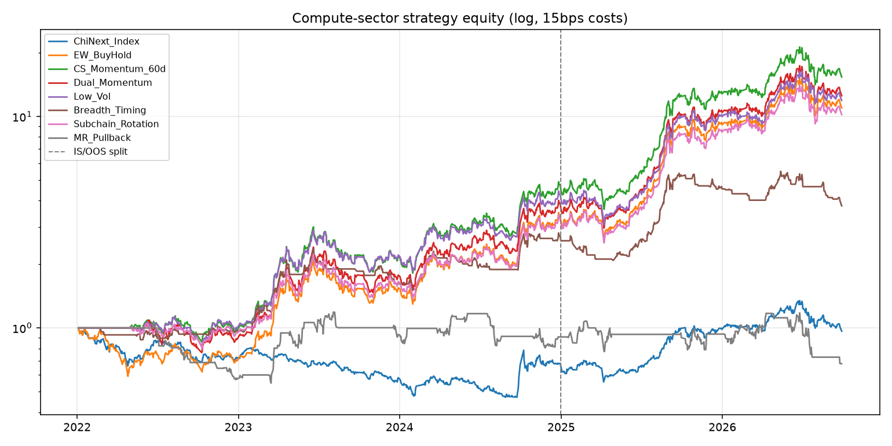

# 算力板块交易策略研究报告

- 数据截止: **2026-09-28**
- 回测区间: 2022-01 ~ 2026-09-28；样本内 ≤ 2024-12-31，样本外 > 2024-12-31
- 样本池: 12 只代表性算力链标的（光模块 / AI芯片 / 服务器 / PCB / 液冷 / 接口芯片 / 通信设备）
- 成本假设: 单边 **15bps**（佣金 + 印花税摊销 + 滑点）；信号收盘产生，下一交易日收益成交
- 基准: 创业板指 buy&hold；内部对照: 算力等权 buy&hold
- 复现: `python3 scripts/suanli_research/run_research.py`

## 1. Executive Summary

当前样本池处于明确回调：MA20 上方仅 **8%**，MA60 上方 **0%**，等权指数判定为 **bear/sideways**，20 日年化波动约 **43.5%**。近 3 个月几乎全线下跌（约 -14% ~ -38%）。

**关键结论（证据导向）**：
1. 相对创业板指，算力主题 beta 在 2022–2026 提供了显著超额（等权 Full Sharpe **1.33** vs 创业板 **0.13**）。
2. 在主题内部，真正稳定跑赢“等权持有”的是 **截面动量 CS_Momentum_60d**（Full Sharpe **1.52**，超额 +0.19）与 **低波 Low_Vol**（Full Sharpe **1.45**，MDD 最小 **-36.4%**）。
3. **均值回归 MR_Pullback 失败**（Sharpe≈0），说明算力更偏趋势/拥挤交易，不宜用经典超卖抄底。
4. **无一策略满足严格质量门槛 MDD < 30%**——主题波动结构决定了“高夏普但深回撤”；部署必须降杠杆或叠加择时。
5. 当前广度极弱，**Breadth_Timing 处于空仓状态**，与盘面一致；若做右侧，应等广度修复，而非左侧摊平。

### Top recommendations (conditional)

1. **CS_Momentum_60d** — Full Sharpe 1.52 (excess vs EW **+0.19**), MDD -39.6%, OOS Sharpe 1.75
2. **Low_Vol** — Full Sharpe 1.45 (excess vs EW **+0.13**), MDD -36.4%, OOS Sharpe 1.62
3. **Dual_Momentum** — Full Sharpe 1.40 (excess vs EW **+0.07**), MDD -39.1%, OOS Sharpe 1.75
4. **Subchain_Rotation** — Full Sharpe 1.35 (excess vs EW **+0.02**), MDD -38.7%, OOS Sharpe 1.70
5. **EW_BuyHold** — Full Sharpe 1.33 (theme beta baseline), MDD -41.1%, OOS Sharpe 1.75

## 2. Market Analysis

| 代码 | 名称 | 细分 | 1M | 3M | 1Y | >MA20 | >MA60 |
| --- | --- | --- | ---: | ---: | ---: | :---: | :---: |
| 000063 | 中兴通讯 | 通信设备 | -9.3% | -13.9% | -28.9% | N | N |
| 601138 | 工业富联 | 服务器 | -7.7% | -17.6% | 1.5% | N | N |
| 300394 | 天孚通信 | 光器件 | -8.2% | -19.0% | 74.2% | N | N |
| 002463 | 沪电股份 | PCB | -4.0% | -23.3% | 69.0% | N | N |
| 603019 | 中科曙光 | 服务器 | -7.5% | -25.4% | -12.7% | N | N |
| 002837 | 英维克 | 液冷 | -17.6% | -31.7% | -6.6% | N | N |
| 688008 | 澜起科技 | 接口芯片 | -5.7% | -32.6% | 78.6% | Y | N |
| 300502 | 新易盛 | 光模块 | -2.3% | -34.2% | 47.7% | N | N |
| 688041 | 海光信息 | AI芯片 | -2.2% | -35.1% | 9.0% | N | N |
| 300308 | 中际旭创 | 光模块 | -5.9% | -35.8% | 85.8% | N | N |
| 688256 | 寒武纪 | AI芯片 | -2.7% | -36.1% | 9.7% | N | N |
| 300476 | 胜宏科技 | PCB | -18.8% | -38.4% | -36.5% | N | N |

### Facts vs interpretation

- **事实**: 全球 AI 资本开支与高速互联（800G/1.6T 光模块）、国产算力芯片、AI 服务器/PCB/液冷仍是主叙事；样本 1Y 收益分化极大（中际旭创 +86% vs 胜宏 -36%）。
- **事实**: 近 1–3 个月样本普跌，广度塌陷，波动升至 ~43% 年化。
- **解释**: 这是典型的主题拥挤后回撤段；动量策略在趋势期有效，但此刻继续追涨风险回报比差。优先现金/低暴露，等待广度回升。

## 3. Strategy Details

| Strategy | Edge thesis | Spec |
| --- | --- | --- |
| EW_BuyHold | 主题 beta | 等权常满仓 |
| CS_Momentum_60d | 强者恒强 / 资金抱团 | 月度 top-4 by 60d return |
| Dual_Momentum | 绝对+相对动量，熊市可空仓 | 月度 top-3 且 90d>0，否则现金 |
| MA_Trend_Filter | 趋势过滤降噪声 | close>MA20>MA60 等权 |
| MR_Pullback | 趋势内超卖修复 | MA60 多头 + RSI/MA20 超卖 |
| Volume_Breakout | 放量突破惯性 | 20日新高 + 1.5x量能，持有10日 |
| Breadth_Timing | 板块风险开关 | 广度>55% 才等权，否则现金 |
| Low_Vol | 主题内防御 | 月度最低 60d 波动 4 只 |
| Subchain_Rotation | 细分景气轮动 | 60d 最强细分链等权 |

实现代码见 `scripts/suanli_research/run_research.py`（可直接复现）。

## 4. Backtest Results

| Strategy | CAGR | Sharpe | Sortino | MDD | OOS Sharpe | OOS CAGR | Excess Sharpe vs EW |
| --- | ---: | ---: | ---: | ---: | ---: | ---: | ---: |
| ChiNext_Index | -0.7% | 0.13 | 0.20 | -52.9% | 0.94 | 27.5% | n/a |
| CS_Momentum_60d | 78.1% | 1.52 | 2.51 | -39.6% | 1.75 | 106.5% | +0.19 |
| Low_Vol | 68.8% | 1.45 | 2.39 | -36.4% | 1.62 | 89.2% | +0.13 |
| Dual_Momentum | 70.6% | 1.40 | 2.31 | -39.1% | 1.75 | 106.5% | +0.07 |
| Subchain_Rotation | 63.4% | 1.35 | 2.17 | -38.7% | 1.70 | 101.2% | +0.02 |
| EW_BuyHold | 65.9% | 1.33 | 2.27 | -41.1% | 1.75 | 106.5% | +0.00 |
| Volume_Breakout | 63.1% | 1.23 | 1.90 | -51.9% | 1.73 | 119.0% | -0.10 |
| MA_Trend_Filter | 49.7% | 1.03 | 1.67 | -47.7% | 1.18 | 63.0% | -0.30 |
| Breadth_Timing | 32.4% | 1.01 | 1.25 | -35.6% | 0.81 | 24.5% | -0.32 |
| MR_Pullback | -7.9% | -0.02 | -0.03 | -48.9% | -0.16 | -15.4% | -1.35 |

### Parameter sensitivity (CS / Dual / LowVol)

- **CS_Momentum**: lookback∈{40,60,90,120}, topN∈{3,4,5} → Full Sharpe 集中在 **1.43–1.54**，OOS Sharpe 几乎都是 **1.75**，对参数不敏感（好事），但也说明 OOS 段主题整体单边、策略区分度下降。
- **Dual_Momentum**: Full Sharpe **1.35–1.53**；`lb=120,n=4` 略优。现金过滤在深熊更有价值，本段 OOS 多为正动量，故与等权接近。
- **Low_Vol**: Full Sharpe **1.26–1.52**；`lb=60,n=4/5` 较稳，MDD 多在 **-35% ~ -42%**。

## 5. Comparison & Ranking

排序键：相对等权的 Full Sharpe 超额 → MDD（回撤小更好）→ OOS Sharpe。

1. `CS_Momentum_60d` — CONDITIONAL; excess Sharpe +0.19; MDD -39.6%
2. `Low_Vol` — CONDITIONAL; excess Sharpe +0.13; MDD -36.4%
3. `Dual_Momentum` — CONDITIONAL; excess Sharpe +0.07; MDD -39.1%
4. `Subchain_Rotation` — CONDITIONAL; excess Sharpe +0.02; MDD -38.7%
5. `EW_BuyHold` — CONDITIONAL; excess Sharpe +0.00; MDD -41.1%
6. `Volume_Breakout` — WEAK; excess Sharpe -0.10; MDD -51.9%
7. `MA_Trend_Filter` — WEAK; excess Sharpe -0.30; MDD -47.7%
8. `Breadth_Timing` — CONDITIONAL; excess Sharpe -0.32; MDD -35.6%
9. `MR_Pullback` — WEAK; excess Sharpe -1.35; MDD -48.9%

严格门槛（扣成本后夏普>1 且 MDD>-30% 且稳健跨体制）:**全部未通过**（回撤门槛）。

## 6. Final Recommendations

### 现在（广度塌陷）

1. **优先空仓/低仓**：`Breadth_Timing` 逻辑给出风险关闭信号；不宜新开动量追涨。
2. **若必须维持主题暴露**：用 **Low_Vol**（相对更抗跌）或极小仓等权，单票≤15–20%。
3. **废弃**：`MR_Pullback`（样本内外均无效）。

### 广度修复后（建议触发：MA20 上方占比重新 >55%）

1. **CS_Momentum_60d** — 主题内进攻主力（全样本超额最清晰）。
2. **Dual_Momentum** — 作为风险开关版动量（绝对动量转负时降仓）。
3. **Subchain_Rotation** — 卫星仓，捕捉光模块/芯片/PCB 轮动。

## 7. Deployment Considerations

- 目标波动 20–25% 年化时，约需把名义仓位降到回测满仓的 **50–60%**（因主题自身波动常 >40%）。
- 再平衡：动量/低波/细分别用月度；避免日频过度交易创业板/科创板冲击成本。
- 涨跌停与停牌未建模；龙头放量日滑点可能 >>15bps。
- 监控：广度、60日相对创业板指超额、子链拥挤（光模块成交额占比）。

## 8. What Could Go Wrong / Invalidation

- AI capex 不及预期、出口管制、业绩证伪 → 动量与突破同步失效。
- 风格从成长切向价值 → 等权与动量回撤扩大。
- 小样本主题池的数据挖掘偏差；OOS 段策略净值高度相关，超额可能不稳定。
- **失效条件**: 滚动 6 个月相对等权超额 Sharpe < 0，或广度 >70% 后策略仍连续 3 个月跑输等权 → 停用。

## Final self-check

- Edge real or overfitting? 截面动量相对等权有稳定但不大的超额；OOS 多策略高度同质，需警惕“只是买了 beta”。
- Regimes covered? 含 2022 熊、2023–2024 复苏、2025–2026 AI 狂潮与当前回撤。
- Missing: 基本面/订单/期权流、涨跌停成交约束、更大股票池与行业中性化。